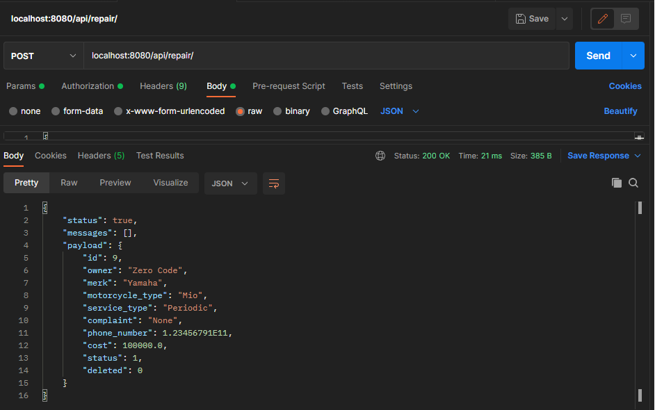

requirement
* JDK 11
* Code Editor (VS Code / Intellij Idea)
* Postman / Application Rest Client

How To Running
* Open CodingInterviewApplication.java first
* Right click on the file and select run 'CodingInterviewApplication.java' / CTRL + SHIFT + F10 (Intellij Idea Code Editor)
* If you use vscode you need to install some extensions first
* If server ready open postman and write localhost:8080/api/repair
* Before that you must be setup your database in your local

Add motorcycle service data

Show All Data

Search By Status

for this case I use number status to make development easier

Update motorcycle service data

